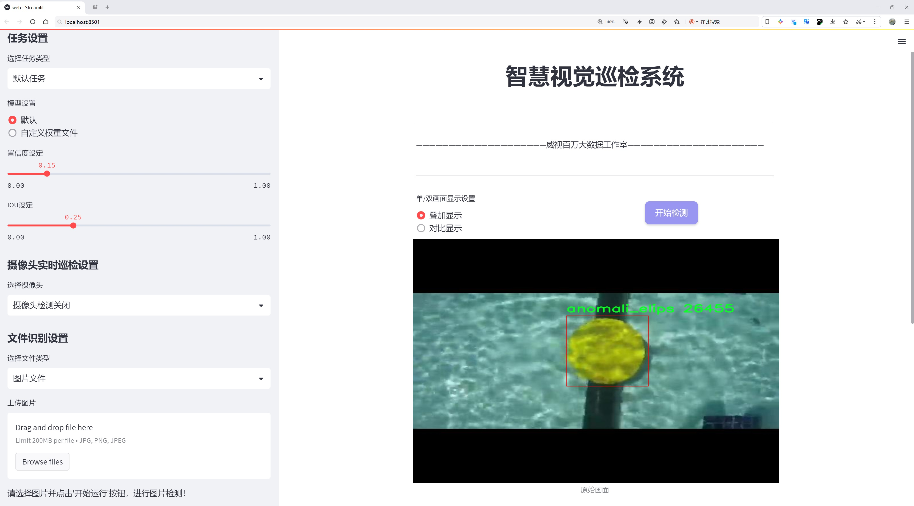
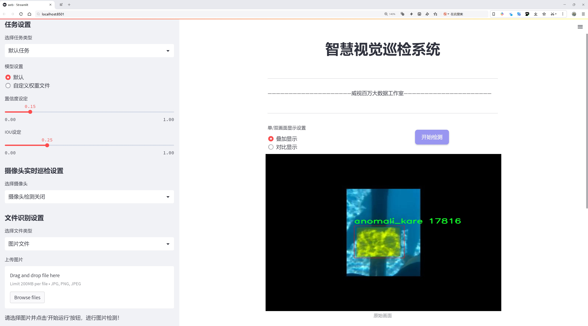
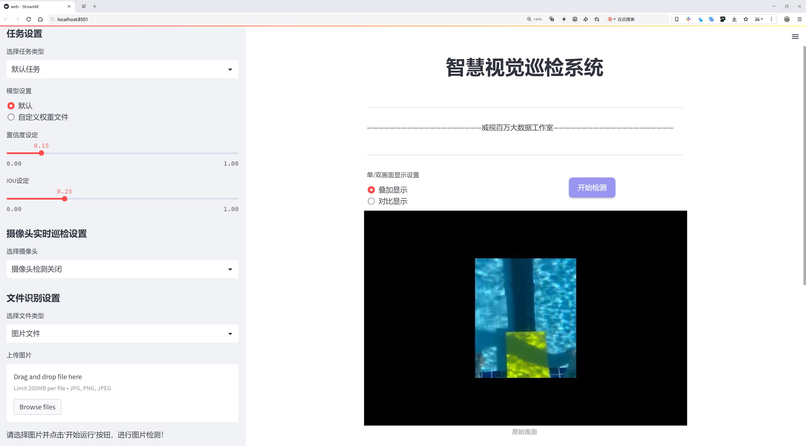
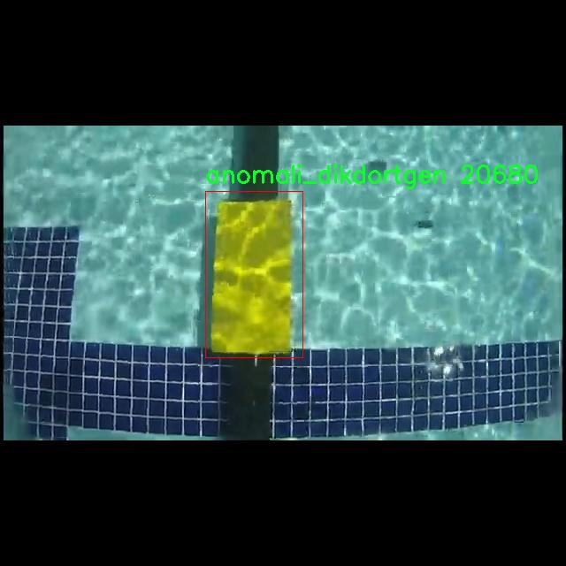
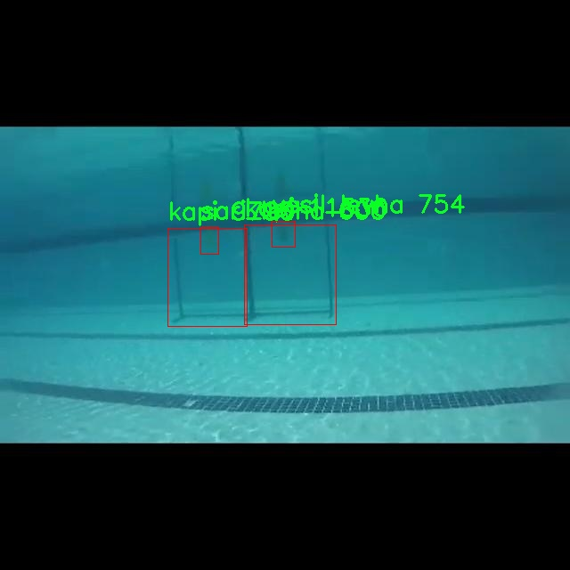
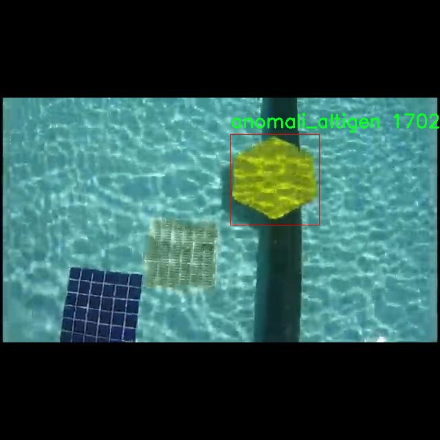
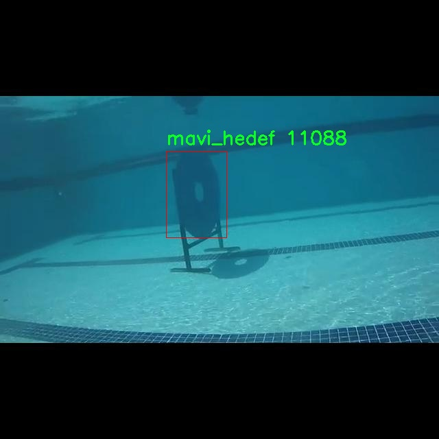
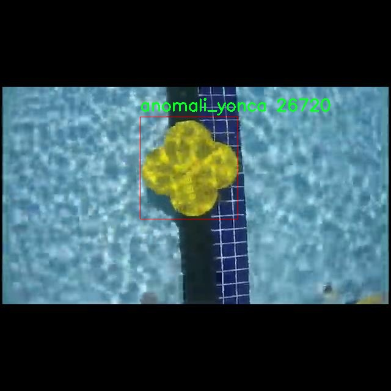

# 泳池异常检测检测系统源码分享
 # [一条龙教学YOLOV8标注好的数据集一键训练_70+全套改进创新点发刊_Web前端展示]

### 1.研究背景与意义

项目参考[AAAI Association for the Advancement of Artificial Intelligence](https://gitee.com/qunmasj/projects)

项目来源[AACV Association for the Advancement of Computer Vision](https://kdocs.cn/l/cszuIiCKVNis)

研究背景与意义

随着社会的快速发展，游泳池作为一种广受欢迎的休闲娱乐场所，其安全性问题日益受到关注。泳池环境复杂，水面反射、光线变化以及人流密集等因素，使得传统的安全监控手段难以有效识别潜在的异常情况。因此，基于计算机视觉的泳池异常检测系统的研究显得尤为重要。近年来，深度学习技术的迅猛发展为物体检测提供了新的解决方案，其中YOLO（You Only Look Once）系列模型因其高效性和实时性而备受青睐。YOLOv8作为该系列的最新版本，具有更强的特征提取能力和更快的推理速度，为泳池异常检测提供了良好的技术基础。

在泳池环境中，异常情况可能包括溺水、打斗、意外事故等，这些情况的及时发现对于保障游泳者的安全至关重要。现有的泳池监控系统多依赖于人工监控或简单的图像处理技术，存在反应迟缓、误报率高等问题。基于YOLOv8的泳池异常检测系统，能够通过对实时视频流的分析，快速识别出潜在的异常行为，从而实现对游泳者的实时监控和预警。这一系统的构建，不仅能够提高泳池的安全性，还能为游泳者提供更为安心的游泳环境。

在数据集方面，本研究采用了Anamoli数据集，该数据集包含6700幅图像，涵盖17个类别的异常情况。这些类别包括各种形状的异常物体，如圆形、方形、三角形等，以及不同颜色的目标，如红色、蓝色、黄色和绿色的目标和门。这些丰富的类别信息为模型的训练提供了充分的样本，能够帮助YOLOv8更好地学习和识别泳池中的各种异常情况。通过对这些数据的深入分析和处理，可以有效提升模型的检测精度和鲁棒性。

本研究的意义不仅在于技术层面的创新，更在于其对社会安全的积极影响。通过构建一个高效的泳池异常检测系统，可以显著降低游泳池事故的发生率，保护游泳者的生命安全。此外，该系统的应用还可以为泳池管理者提供数据支持，帮助其更好地进行安全管理和风险评估。未来，该技术还可以扩展到其他公共场所的安全监控中，为社会的安全保障提供更为全面的解决方案。

综上所述，基于改进YOLOv8的泳池异常检测系统的研究，不仅具有重要的学术价值，还有着广泛的应用前景。通过对泳池环境中异常情况的有效识别和监控，能够为游泳者提供更安全的游泳体验，同时推动智能监控技术的发展，为公共安全领域的研究提供新的思路和方法。

### 2.图片演示







##### 注意：由于此博客编辑较早，上面“2.图片演示”和“3.视频演示”展示的系统图片或者视频可能为老版本，新版本在老版本的基础上升级如下：（实际效果以升级的新版本为准）

  （1）适配了YOLOV8的“目标检测”模型和“实例分割”模型，通过加载相应的权重（.pt）文件即可自适应加载模型。

  （2）支持“图片识别”、“视频识别”、“摄像头实时识别”三种识别模式。

  （3）支持“图片识别”、“视频识别”、“摄像头实时识别”三种识别结果保存导出，解决手动导出（容易卡顿出现爆内存）存在的问题，识别完自动保存结果并导出到tempDir中。

  （4）支持Web前端系统中的标题、背景图等自定义修改，后面提供修改教程。

  另外本项目提供训练的数据集和训练教程,暂不提供权重文件（best.pt）,需要您按照教程进行训练后实现图片演示和Web前端界面演示的效果。

### 3.视频演示

[3.1 视频演示](https://www.bilibili.com/video/BV1xosoetEHp/)

### 4.数据集信息展示

##### 4.1 本项目数据集详细数据（类别数＆类别名）

nc: 18
names: ['anomali_altigen', 'anomali_besgen', 'anomali_daire', 'anomali_dikdortgen', 'anomali_elips', 'anomali_kare', 'anomali_trombus', 'anomali_ucgen', 'anomali_yildiz', 'anomali_yonca', 'kapi', 'kirmizi_hedef', 'kirmizi_levha', 'mavi_hedef', 'mavi_levha', 'sari_levha', 'yesil_hedef', 'yesil_levha']


##### 4.2 本项目数据集信息介绍

数据集信息展示

在本研究中，我们采用了名为“Anamoli”的数据集，以改进YOLOv8的泳池异常检测系统。该数据集专门设计用于识别和分类泳池环境中的各种异常情况，涵盖了18个不同的类别。每个类别代表了一种特定的异常或目标，能够帮助系统更准确地识别潜在的安全隐患和异常行为，从而提高泳池监控的有效性和安全性。

“Anamoli”数据集的类别包括多种形状和颜色的异常标识，具体类别为：‘anomali_altigen’、‘anomali_besgen’、‘anomali_daire’、‘anomali_dikdortgen’、‘anomali_elips’、‘anomali_kare’、‘anomali_trombus’、‘anomali_ucgen’、‘anomali_yildiz’、‘anomali_yonca’、‘kapi’、‘kirmizi_hedef’、‘kirmizi_levha’、‘mavi_hedef’、‘mavi_levha’、‘sari_levha’、‘yesil_hedef’、‘yesil_levha’。这些类别不仅包括几何形状的异常，还涵盖了与安全相关的标识物，如不同颜色的目标和标志。这种多样性使得数据集在训练过程中能够涵盖更广泛的场景，从而提升模型的泛化能力。

在数据集的构建过程中，研究者们精心挑选了多种泳池环境下的图像，确保数据的多样性和代表性。每个类别的样本均经过精确标注，确保在训练过程中，YOLOv8模型能够学习到每种异常的特征。这种细致的标注工作不仅提高了数据集的质量，也为后续的模型训练和评估提供了坚实的基础。

为了确保模型的有效性和准确性，数据集中的图像涵盖了不同的光照条件、天气状况和泳池环境。这种多样化的场景设置使得模型在实际应用中能够更好地适应各种复杂情况，增强了其在真实世界中的应用潜力。例如，在阳光明媚的日子和阴雨天气下，泳池的外观和人们的行为可能会有所不同，而“Anamoli”数据集正是通过包含这些变化来提升模型的鲁棒性。

此外，数据集的设计还考虑到了泳池安全管理的实际需求。通过对异常情况的及时检测，泳池管理者能够迅速采取措施，确保游泳者的安全。数据集中包含的各类目标和标识物，如‘kirmizi_hedef’（红色目标）和‘yesil_hedef’（绿色目标），不仅有助于异常检测，还可以用于泳池环境中的指示和警示，进一步提升安全管理的效率。

综上所述，“Anamoli”数据集为改进YOLOv8的泳池异常检测系统提供了丰富而多样的训练数据。通过对18个类别的细致分类和标注，该数据集不仅增强了模型的学习能力，也为实际应用中的安全监控提供了有力支持。随着技术的不断进步，基于该数据集的研究将有助于推动泳池安全管理的智能化和自动化进程，为人们的休闲活动提供更安全的保障。











### 5.全套项目环境部署视频教程（零基础手把手教学）

[5.1 环境部署教程链接（零基础手把手教学）](https://www.ixigua.com/7404473917358506534?logTag=c807d0cbc21c0ef59de5)


[5.2 安装Python虚拟环境创建和依赖库安装视频教程链接（零基础手把手教学）](https://www.ixigua.com/7404474678003106304?logTag=1f1041108cd1f708b01a)

### 6.手把手YOLOV8训练视频教程（零基础小白有手就能学会）

[6.1 手把手YOLOV8训练视频教程（零基础小白有手就能学会）](https://www.ixigua.com/7404477157818401292?logTag=d31a2dfd1983c9668658)

### 7.70+种全套YOLOV8创新点代码加载调参视频教程（一键加载写好的改进模型的配置文件）

[7.1 70+种全套YOLOV8创新点代码加载调参视频教程（一键加载写好的改进模型的配置文件）](https://www.ixigua.com/7404478314661806627?logTag=29066f8288e3f4eea3a4)

### 8.70+种全套YOLOV8创新点原理讲解（非科班也可以轻松写刊发刊，V10版本正在科研待更新）

由于篇幅限制，每个创新点的具体原理讲解就不一一展开，具体见下列网址中的创新点对应子项目的技术原理博客网址【Blog】：


[8.1 70+种全套YOLOV8创新点原理讲解链接](https://gitee.com/qunmasj/good)

### 9.系统功能展示（检测对象为举例，实际内容以本项目数据集为准）

图9.1.系统支持检测结果表格显示

  图9.2.系统支持置信度和IOU阈值手动调节

  图9.3.系统支持自定义加载权重文件best.pt(需要你通过步骤5中训练获得)

  图9.4.系统支持摄像头实时识别

  图9.5.系统支持图片识别

  图9.6.系统支持视频识别

  图9.7.系统支持识别结果文件自动保存

  图9.8.系统支持Excel导出检测结果数据


### 10.原始YOLOV8算法原理

原始YOLOv8算法原理

YOLOv8算法是目标检测领域的一个重要里程碑，它在YOLO系列的基础上进行了深度优化，旨在提高目标检测的准确性和速度。YOLOv8s模型的设计理念是通过更高效的特征提取和目标检测机制，来满足现代计算机视觉应用的需求。该模型的核心架构分为三个主要部分：Backbone、Neck和Head，每个部分都在原有YOLO模型的基础上进行了创新和改进。

在特征提取阶段，YOLOv8s采用了CSPDarknet作为Backbone网络。CSPDarknet通过将网络分为两个部分，并在每个部分中引入多个残差块，极大地增强了特征提取的能力。与前代模型YOLOv5相比，YOLOv8s引入了C2f模块，这一模块通过将输入特征图分为两个分支并分别进行降维处理，显著提高了特征图的维度和丰富性。C2f模块的设计灵感来源于ELAN模块，它通过增加残差连接，使得梯度信息能够更有效地在网络中流动，从而提升了模型的学习能力和性能。

YOLOv8s还引入了快速空间金字塔池化（SPPF）结构，这一创新使得模型能够有效提取不同尺度的特征。SPPF的设计不仅减少了模型的参数量和计算量，还提高了特征提取的效率，确保了在多尺度目标检测时，模型能够保持较高的准确性。通过这些改进，YOLOv8s在特征提取阶段就奠定了坚实的基础，为后续的目标检测提供了丰富的特征信息。

在目标检测阶段，YOLOv8s采用了特征金字塔网络（FPN）和路径聚合网络（PAN）的结合结构。这一结构通过多个卷积层和池化层的组合，有效地处理和压缩特征图，使得模型能够更好地捕捉到目标的空间信息和上下文信息。YOLOv8s的目标检测部分还采用了无锚框（Anchor-Free）的方法，这一创新直接预测目标的中心点和宽高比例，避免了传统锚框方法带来的复杂性和局限性。无锚框检测方式的引入，使得YOLOv8s在检测速度和准确度上都得到了显著提升。

此外，YOLOv8s在训练过程中引入了多尺度训练和测试策略，这一策略使得模型能够在不同的输入尺度下进行训练，从而增强了模型的泛化能力和鲁棒性。通过对训练数据的动态增强，YOLOv8s能够更好地适应各种复杂场景，提高了在实际应用中的表现。特别是在一些对实时性要求较高的应用场景中，如智能监控和自动驾驶，YOLOv8s的高帧率和高准确度使其成为了理想的选择。

YOLOv8s还在损失计算方面进行了创新，采用了BCELoss作为分类损失，DFLLoss和CIoULoss作为回归损失。这种多损失函数的设计，使得模型在训练过程中能够更好地平衡分类和回归任务，从而提高了整体的检测性能。

总的来说，YOLOv8s通过对Backbone、Neck和Head的深度优化，结合无锚框检测方法和多尺度训练策略，形成了一种高效、灵活且强大的目标检测算法。其在精度和速度上的显著提升，使得YOLOv8s在目标检测领域中占据了重要的地位，广泛应用于智能监控、自动驾驶、人脸识别等多个场景。随着YOLOv8的推出，目标检测技术在实际应用中的表现得到了进一步的提升，为未来的研究和应用奠定了坚实的基础。


### 11.项目核心源码讲解（再也不用担心看不懂代码逻辑）

#### 11.1 70+种YOLOv8算法改进源码大全和调试加载训练教程（非必要）\ultralytics\utils\tal.py

以下是经过简化和注释的核心代码部分，主要涉及目标检测中的任务对齐分配器（TaskAlignedAssigner）及其相关功能。

```python
import torch
import torch.nn as nn

def select_candidates_in_gts(xy_centers, gt_bboxes, eps=1e-9):
    """
    选择在真实框（gt）中的正锚点中心。

    参数:
        xy_centers (Tensor): 形状为(h*w, 2)的张量，表示锚点中心的坐标。
        gt_bboxes (Tensor): 形状为(b, n_boxes, 4)的张量，表示真实框的坐标。

    返回:
        (Tensor): 形状为(b, n_boxes, h*w)的张量，表示每个真实框内的锚点。
    """
    n_anchors = xy_centers.shape[0]
    bs, n_boxes, _ = gt_bboxes.shape
    lt, rb = gt_bboxes.view(-1, 1, 4).chunk(2, 2)  # 分离左上角和右下角坐标
    bbox_deltas = torch.cat((xy_centers[None] - lt, rb - xy_centers[None]), dim=2).view(bs, n_boxes, n_anchors, -1)
    return bbox_deltas.amin(3).gt_(eps)  # 返回每个锚点与真实框的最小距离是否大于eps

class TaskAlignedAssigner(nn.Module):
    """
    任务对齐分配器，用于目标检测。

    属性:
        topk (int): 考虑的前k个候选框数量。
        num_classes (int): 目标类别数量。
        alpha (float): 分类组件的超参数。
        beta (float): 定位组件的超参数。
        eps (float): 防止除以零的小值。
    """

    def __init__(self, topk=13, num_classes=80, alpha=1.0, beta=6.0, eps=1e-9):
        """初始化任务对齐分配器对象，设置超参数。"""
        super().__init__()
        self.topk = topk
        self.num_classes = num_classes
        self.bg_idx = num_classes  # 背景类别索引
        self.alpha = alpha
        self.beta = beta
        self.eps = eps

    @torch.no_grad()
    def forward(self, pd_scores, pd_bboxes, anc_points, gt_labels, gt_bboxes, mask_gt):
        """
        计算任务对齐分配。

        参数:
            pd_scores (Tensor): 形状为(bs, num_total_anchors, num_classes)的张量，表示锚点的预测分数。
            pd_bboxes (Tensor): 形状为(bs, num_total_anchors, 4)的张量，表示锚点的预测框。
            anc_points (Tensor): 形状为(num_total_anchors, 2)的张量，表示锚点的坐标。
            gt_labels (Tensor): 形状为(bs, n_max_boxes, 1)的张量，表示真实框的标签。
            gt_bboxes (Tensor): 形状为(bs, n_max_boxes, 4)的张量，表示真实框的坐标。
            mask_gt (Tensor): 形状为(bs, n_max_boxes, 1)的张量，表示真实框的掩码。

        返回:
            target_labels (Tensor): 形状为(bs, num_total_anchors)的张量，表示目标标签。
            target_bboxes (Tensor): 形状为(bs, num_total_anchors, 4)的张量，表示目标框。
            target_scores (Tensor): 形状为(bs, num_total_anchors, num_classes)的张量，表示目标分数。
            fg_mask (Tensor): 形状为(bs, num_total_anchors)的布尔张量，表示前景锚点。
            target_gt_idx (Tensor): 形状为(bs, num_total_anchors)的张量，表示目标真实框索引。
        """
        self.bs = pd_scores.size(0)
        self.n_max_boxes = gt_bboxes.size(1)

        if self.n_max_boxes == 0:
            device = gt_bboxes.device
            return (torch.full_like(pd_scores[..., 0], self.bg_idx).to(device), 
                    torch.zeros_like(pd_bboxes).to(device),
                    torch.zeros_like(pd_scores).to(device), 
                    torch.zeros_like(pd_scores[..., 0]).to(device),
                    torch.zeros_like(pd_scores[..., 0]).to(device))

        # 获取正锚点掩码和对齐度量
        mask_pos, align_metric, overlaps = self.get_pos_mask(pd_scores, pd_bboxes, gt_labels, gt_bboxes, anc_points, mask_gt)

        # 选择重叠度最高的真实框
        target_gt_idx, fg_mask, mask_pos = select_highest_overlaps(mask_pos, overlaps, self.n_max_boxes)

        # 获取目标标签、框和分数
        target_labels, target_bboxes, target_scores = self.get_targets(gt_labels, gt_bboxes, target_gt_idx, fg_mask)

        # 归一化对齐度量
        align_metric *= mask_pos
        pos_align_metrics = align_metric.amax(dim=-1, keepdim=True)  # 计算正锚点的最大对齐度量
        pos_overlaps = (overlaps * mask_pos).amax(dim=-1, keepdim=True)  # 计算正锚点的最大重叠度
        norm_align_metric = (align_metric * pos_overlaps / (pos_align_metrics + self.eps)).amax(-2).unsqueeze(-1)
        target_scores = target_scores * norm_align_metric  # 更新目标分数

        return target_labels, target_bboxes, target_scores, fg_mask.bool(), target_gt_idx

    def get_pos_mask(self, pd_scores, pd_bboxes, gt_labels, gt_bboxes, anc_points, mask_gt):
        """获取正锚点掩码，形状为(b, max_num_obj, h*w)。"""
        mask_in_gts = select_candidates_in_gts(anc_points, gt_bboxes)  # 选择在真实框中的锚点
        align_metric, overlaps = self.get_box_metrics(pd_scores, pd_bboxes, gt_labels, gt_bboxes, mask_in_gts * mask_gt)  # 计算对齐度量和重叠度
        mask_topk = self.select_topk_candidates(align_metric, topk_mask=mask_gt.expand(-1, -1, self.topk).bool())  # 选择前k个候选
        mask_pos = mask_topk * mask_in_gts * mask_gt  # 合并掩码

        return mask_pos, align_metric, overlaps

    def get_box_metrics(self, pd_scores, pd_bboxes, gt_labels, gt_bboxes, mask_gt):
        """计算给定预测框和真实框的对齐度量。"""
        na = pd_bboxes.shape[-2]
        mask_gt = mask_gt.bool()  # 转换为布尔类型掩码
        overlaps = torch.zeros([self.bs, self.n_max_boxes, na], dtype=pd_bboxes.dtype, device=pd_bboxes.device)
        bbox_scores = torch.zeros([self.bs, self.n_max_boxes, na], dtype=pd_scores.dtype, device=pd_scores.device)

        ind = torch.zeros([2, self.bs, self.n_max_boxes], dtype=torch.long)  # 创建索引
        ind[0] = torch.arange(end=self.bs).view(-1, 1).expand(-1, self.n_max_boxes)  # 扩展为(b, max_num_obj)
        ind[1] = gt_labels.squeeze(-1)  # 获取真实框标签
        bbox_scores[mask_gt] = pd_scores[ind[0], :, ind[1]][mask_gt]  # 获取每个锚点的分数

        # 计算重叠度
        pd_boxes = pd_bboxes.unsqueeze(1).expand(-1, self.n_max_boxes, -1, -1)[mask_gt]
        gt_boxes = gt_bboxes.unsqueeze(2).expand(-1, -1, na, -1)[mask_gt]
        overlaps[mask_gt] = bbox_iou(gt_boxes, pd_boxes, xywh=False, CIoU=True).squeeze(-1).clamp_(0)  # 计算IoU

        align_metric = bbox_scores.pow(self.alpha) * overlaps.pow(self.beta)  # 计算对齐度量
        return align_metric, overlaps

    def get_targets(self, gt_labels, gt_bboxes, target_gt_idx, fg_mask):
        """
        计算正锚点的目标标签、目标框和目标分数。

        参数:
            gt_labels (Tensor): 真实框标签，形状为(b, max_num_obj, 1)。
            gt_bboxes (Tensor): 真实框坐标，形状为(b, max_num_obj, 4)。
            target_gt_idx (Tensor): 正锚点的真实框索引，形状为(b, h*w)。
            fg_mask (Tensor): 布尔张量，形状为(b, h*w)，表示前景锚点。

        返回:
            (Tuple[Tensor, Tensor, Tensor]): 包含目标标签、目标框和目标分数的元组。
        """
        batch_ind = torch.arange(end=self.bs, dtype=torch.int64, device=gt_labels.device)[..., None]
        target_gt_idx = target_gt_idx + batch_ind * self.n_max_boxes  # 更新索引
        target_labels = gt_labels.long().flatten()[target_gt_idx]  # 获取目标标签

        target_bboxes = gt_bboxes.view(-1, 4)[target_gt_idx]  # 获取目标框
        target_labels.clamp_(0)  # 限制标签范围

        # 计算目标分数
        target_scores = torch.zeros((target_labels.shape[0], target_labels.shape[1], self.num_classes),
                                    dtype=torch.int64,
                                    device=target_labels.device)  # 初始化目标分数
        target_scores.scatter_(2, target_labels.unsqueeze(-1), 1)  # 将目标标签映射到分数

        fg_scores_mask = fg_mask[:, :, None].repeat(1, 1, self.num_classes)  # 扩展前景掩码
        target_scores = torch.where(fg_scores_mask > 0, target_scores, 0)  # 仅保留前景分数

        return target_labels, target_bboxes, target_scores
```

### 代码说明
1. **选择候选框**：`select_candidates_in_gts`函数用于选择锚点中心是否在真实框内，返回一个布尔张量。
2. **任务对齐分配器**：`TaskAlignedAssigner`类实现了目标检测中的任务对齐分配，负责将真实框与锚点进行匹配。
3. **前向传播**：`forward`方法实现了任务对齐分配的核心逻辑，包括计算正锚点掩码、对齐度量、目标标签、框和分数。
4. **计算对齐度量**：`get_box_metrics`方法计算预测框与真实框之间的对齐度量和重叠度。
5. **获取目标**：`get_targets`方法根据计算得到的索引和掩码获取目标标签、框和分数。

以上是代码的核心部分和详细注释，便于理解其功能和实现逻辑。

这个文件是YOLOv8算法中的一个重要模块，主要用于目标检测中的任务对齐分配（Task-Aligned Assignment）。该模块的核心功能是将真实的目标（ground truth）与锚框（anchor boxes）进行匹配，以便在训练过程中优化目标检测模型的性能。

首先，文件导入了必要的库，包括PyTorch和一些自定义的工具函数。它定义了一些常量和函数，用于处理锚框和真实目标之间的关系。`select_candidates_in_gts`函数用于选择在真实目标框内的锚框中心，返回一个布尔张量，指示哪些锚框是有效的。`select_highest_overlaps`函数则处理当一个锚框被多个真实目标框分配时，选择与哪个目标框的重叠度最高。

接下来，定义了`TaskAlignedAssigner`类，这是一个继承自`nn.Module`的模块，负责执行任务对齐分配。该类的构造函数初始化了一些超参数，包括考虑的最大候选框数量、类别数量以及用于分类和定位的参数。`forward`方法是该类的核心，接受预测的分数、边界框、锚点、真实标签和边界框等输入，计算并返回目标标签、目标边界框、目标分数、前景掩码和目标索引。

在`forward`方法中，首先检查是否有真实目标框，如果没有，则返回全为背景的标签和零的边界框。接着，通过调用`get_pos_mask`方法计算正样本的掩码、对齐度量和重叠度。然后，使用`select_highest_overlaps`函数来选择具有最高重叠度的真实目标框。最后，调用`get_targets`方法来获取目标标签、边界框和分数，并进行归一化处理。

`get_pos_mask`方法用于获取正样本的掩码，计算对齐度量和重叠度。`get_box_metrics`方法计算预测边界框与真实边界框之间的对齐度量，使用IoU（Intersection over Union）作为重叠度的度量。`select_topk_candidates`方法则根据给定的度量选择前k个候选框。

此外，文件中还定义了一些辅助函数，如`make_anchors`用于生成锚框，`dist2bbox`和`bbox2dist`用于在不同表示形式之间转换边界框。

总体来说，这个文件实现了YOLOv8目标检测模型中锚框与真实目标之间的有效匹配机制，旨在提高模型的检测精度和效率。通过对锚框的选择和分配，模型能够更好地学习到目标的特征，从而在实际应用中表现出色。

#### 11.2 ui.py

以下是经过简化并注释的核心代码部分：

```python
import sys
import subprocess

def run_script(script_path):
    """
    使用当前 Python 环境运行指定的脚本。

    Args:
        script_path (str): 要运行的脚本路径

    Returns:
        None
    """
    # 获取当前 Python 解释器的路径
    python_path = sys.executable

    # 构建运行命令，使用 streamlit 运行指定的脚本
    command = f'"{python_path}" -m streamlit run "{script_path}"'

    # 执行命令，并等待其完成
    result = subprocess.run(command, shell=True)
    
    # 检查命令执行结果，如果返回码不为0，表示出错
    if result.returncode != 0:
        print("脚本运行出错。")

# 主程序入口
if __name__ == "__main__":
    # 指定要运行的脚本路径
    script_path = "web.py"  # 这里可以直接指定脚本名，假设在当前目录下

    # 调用函数运行脚本
    run_script(script_path)
```

### 代码注释说明：
1. **导入模块**：
   - `sys`：用于获取当前 Python 解释器的路径。
   - `subprocess`：用于执行外部命令。

2. **`run_script` 函数**：
   - 接受一个参数 `script_path`，表示要运行的 Python 脚本的路径。
   - 使用 `sys.executable` 获取当前 Python 解释器的路径。
   - 构建一个命令字符串，使用 `streamlit` 模块运行指定的脚本。
   - 使用 `subprocess.run` 执行构建的命令，并等待其完成。
   - 检查命令的返回码，如果不为0，表示脚本运行出错，打印错误信息。

3. **主程序入口**：
   - 使用 `if __name__ == "__main__":` 确保只有在直接运行该脚本时才会执行以下代码。
   - 指定要运行的脚本路径（在这里假设为 `web.py`）。
   - 调用 `run_script` 函数来执行指定的脚本。

这个程序文件名为 `ui.py`，其主要功能是使用当前的 Python 环境来运行一个指定的脚本。程序的核心部分是一个名为 `run_script` 的函数，该函数接受一个参数 `script_path`，即要运行的脚本的路径。

在 `run_script` 函数中，首先通过 `sys.executable` 获取当前 Python 解释器的路径，这样可以确保使用的是正确的 Python 环境。接着，程序构建了一个命令字符串，使用 `streamlit` 模块来运行指定的脚本。具体的命令格式为 `"{python_path}" -m streamlit run "{script_path}"`，其中 `python_path` 是当前 Python 解释器的路径，`script_path` 是要运行的脚本路径。

然后，程序使用 `subprocess.run` 方法来执行构建好的命令。这个方法会在一个新的 shell 中运行命令，并等待其完成。如果命令执行后返回的状态码不为零，表示脚本运行过程中出现了错误，程序会打印出“脚本运行出错。”的提示信息。

在文件的最后部分，使用了一个 `if __name__ == "__main__":` 语句来确保只有在直接运行该脚本时才会执行以下代码。此处指定了要运行的脚本路径 `script_path`，它通过调用 `abs_path("web.py")` 来获取 `web.py` 文件的绝对路径。最后，调用 `run_script(script_path)` 来执行指定的脚本。

总的来说，这个程序的功能是方便地在当前 Python 环境中运行一个名为 `web.py` 的脚本，并处理可能出现的错误。

#### 11.3 70+种YOLOv8算法改进源码大全和调试加载训练教程（非必要）\ultralytics\nn\extra_modules\ops_dcnv3\test.py

以下是代码中最核心的部分，并附上详细的中文注释：

```python
import torch
from functions.dcnv3_func import DCNv3Function, dcnv3_core_pytorch

# 输入和输出的尺寸参数
H_in, W_in = 8, 8  # 输入图像的高度和宽度
N, M, D = 2, 4, 16  # N: 批量大小, M: 输出通道数, D: 每个通道的深度
Kh, Kw = 3, 3  # 卷积核的高度和宽度
remove_center = False  # 是否移除中心点
P = Kh * Kw - remove_center  # 卷积核的有效点数
offset_scale = 2.0  # 偏移缩放因子
pad = 1  # 填充大小
dilation = 1  # 膨胀率
stride = 1  # 步幅
# 计算输出的高度和宽度
H_out = (H_in + 2 * pad - (dilation * (Kh - 1) + 1)) // stride + 1
W_out = (W_in + 2 * pad - (dilation * (Kw - 1) + 1)) // stride + 1

# 设置随机种子以确保结果可复现
torch.manual_seed(3)

@torch.no_grad()
def check_forward_equal_with_pytorch_double():
    # 创建输入、偏移和掩码张量
    input = torch.rand(N, H_in, W_in, M*D).cuda() * 0.01
    offset = torch.rand(N, H_out, W_out, M*P*2).cuda() * 10
    mask = torch.rand(N, H_out, W_out, M, P).cuda() + 1e-5
    mask /= mask.sum(-1, keepdim=True)  # 归一化掩码
    mask = mask.reshape(N, H_out, W_out, M*P)

    # 使用PyTorch的核心函数计算输出
    output_pytorch = dcnv3_core_pytorch(
        input.double(),
        offset.double(),
        mask.double(),
        Kh, Kw, stride, stride, Kh // 2, Kw // 2, dilation, dilation, M, D, offset_scale, remove_center).detach().cpu()

    # 使用自定义的DCNv3函数计算输出
    output_cuda = DCNv3Function.apply(
        input.double(),
        offset.double(),
        mask.double(),
        Kh, Kw, stride, stride, Kh // 2, Kw // 2, dilation, dilation, M, D, offset_scale,
        im2col_step=2, remove_center).detach().cpu()

    # 检查两个输出是否相近
    fwdok = torch.allclose(output_cuda, output_pytorch)
    max_abs_err = (output_cuda - output_pytorch).abs().max()  # 最大绝对误差
    max_rel_err = ((output_cuda - output_pytorch).abs() / output_pytorch.abs()).max()  # 最大相对误差
    print('>>> forward double')
    print(f'* {fwdok} check_forward_equal_with_pytorch_double: max_abs_err {max_abs_err:.2e} max_rel_err {max_rel_err:.2e}')

if __name__ == '__main__':
    check_forward_equal_with_pytorch_double()  # 调用前向检查函数
```

### 代码注释说明：
1. **参数设置**：代码中定义了一些输入输出的尺寸参数和卷积相关的参数，这些参数用于后续的卷积操作。
2. **随机种子**：通过设置随机种子，确保每次运行代码时生成的随机数相同，便于调试和结果复现。
3. **`check_forward_equal_with_pytorch_double` 函数**：该函数用于检查自定义的DCNv3函数与PyTorch核心函数的输出是否一致。
   - 创建输入、偏移和掩码张量，并进行必要的归一化处理。
   - 分别调用PyTorch的核心函数和自定义的DCNv3函数计算输出。
   - 使用`torch.allclose`检查两个输出是否相近，并计算最大绝对误差和最大相对误差。
4. **主程序**：在主程序中调用前向检查函数，验证实现的正确性。

这个程序文件是一个用于测试和验证深度学习中DCNv3（Deformable Convolutional Networks v3）功能的脚本。它主要使用PyTorch框架，并包含了一些函数来检查DCNv3的前向和反向传播的正确性，以及性能测试。

首先，程序导入了一些必要的库，包括PyTorch及其神经网络模块，以及用于进行数值验证的gradcheck函数。接着，定义了一些与DCNv3相关的参数，如输入和输出的高度和宽度、卷积核的大小、步幅、填充等。这些参数在后续的计算中会被用到。

程序中定义了多个函数。`check_forward_equal_with_pytorch_double`和`check_forward_equal_with_pytorch_float`函数用于验证DCNv3的前向传播结果是否与PyTorch的标准实现相同。它们生成随机输入、偏移量和掩码，然后分别调用自定义的DCNv3函数和PyTorch的实现，比较它们的输出。通过计算最大绝对误差和相对误差，程序能够判断两者的输出是否一致。

类似地，`check_backward_equal_with_pytorch_double`和`check_backward_equal_with_pytorch_float`函数用于验证反向传播的梯度计算是否一致。它们通过计算损失的梯度并比较自定义实现与PyTorch实现的梯度，确保两者在反向传播时的行为相同。

最后，`check_time_cost`函数用于测试DCNv3在不同输入规模下的时间性能。它生成一个指定大小的输入，并多次调用DCNv3函数以测量平均运行时间。

在主程序部分，首先调用前向传播的验证函数，然后对不同通道数的输入调用反向传播的验证函数，最后进行时间性能测试。通过这些测试，程序能够确保DCNv3的实现是正确的，并且在性能上也符合预期。整体上，这个文件是一个非常实用的工具，用于验证和调试DCNv3模块的实现。

#### 11.4 code\ultralytics\models\yolo\obb\predict.py

以下是经过简化和注释的核心代码部分：

```python
import torch
from ultralytics.engine.results import Results
from ultralytics.models.yolo.detect.predict import DetectionPredictor
from ultralytics.utils import ops

class OBBPredictor(DetectionPredictor):
    """
    OBBPredictor类扩展了DetectionPredictor类，用于基于定向边界框（OBB）模型进行预测。
    """

    def __init__(self, cfg=DEFAULT_CFG, overrides=None, _callbacks=None):
        """初始化OBBPredictor，支持模型和数据配置的可选覆盖。"""
        super().__init__(cfg, overrides, _callbacks)  # 调用父类构造函数
        self.args.task = "obb"  # 设置任务类型为“obb”

    def postprocess(self, preds, img, orig_imgs):
        """对预测结果进行后处理，并返回Results对象的列表。"""
        # 使用非极大值抑制（NMS）来过滤预测框
        preds = ops.non_max_suppression(
            preds,
            self.args.conf,  # 置信度阈值
            self.args.iou,  # IOU阈值
            agnostic=self.args.agnostic_nms,  # 是否使用类别无关的NMS
            max_det=self.args.max_det,  # 最大检测数量
            nc=len(self.model.names),  # 类别数量
            classes=self.args.classes,  # 选择的类别
            rotated=True,  # 启用旋转边界框
        )

        # 如果输入图像不是列表，则将其转换为numpy数组
        if not isinstance(orig_imgs, list):
            orig_imgs = ops.convert_torch2numpy_batch(orig_imgs)

        results = []  # 存储结果的列表
        for pred, orig_img, img_path in zip(preds, orig_imgs, self.batch[0]):
            # 将预测框的坐标从当前图像大小缩放到原始图像大小
            pred[:, :4] = ops.scale_boxes(img.shape[2:], pred[:, :4], orig_img.shape, xywh=True)
            # 组合边界框坐标、置信度和类别信息
            obb = torch.cat([pred[:, :4], pred[:, -1:], pred[:, 4:6]], dim=-1)
            # 创建Results对象并添加到结果列表
            results.append(Results(orig_img, path=img_path, names=self.model.names, obb=obb))
        return results  # 返回处理后的结果列表
```

### 代码说明：
1. **导入必要的库**：导入了PyTorch和Ultralytics库中的一些模块。
2. **OBBPredictor类**：继承自`DetectionPredictor`，用于处理定向边界框的预测。
3. **构造函数**：初始化时调用父类构造函数，并设置任务类型为“obb”。
4. **后处理函数**：
   - 使用非极大值抑制（NMS）来过滤预测框，确保只保留最相关的框。
   - 将输入图像转换为numpy数组（如果不是列表）。
   - 对每个预测框进行坐标缩放，并组合成一个新的边界框格式。
   - 创建`Results`对象并返回处理后的结果列表。

这个程序文件定义了一个名为 `OBBPredictor` 的类，它是基于面向对象的边界框（Oriented Bounding Box，OBB）模型进行预测的扩展类。该类继承自 `DetectionPredictor`，主要用于处理与 OBB 相关的预测任务。

在文件的开头，首先导入了必要的库，包括 `torch` 和一些来自 `ultralytics` 的模块。这些模块提供了模型预测、结果处理和其他实用功能。

`OBBPredictor` 类的构造函数 `__init__` 接受三个参数：`cfg`（配置），`overrides`（覆盖配置），和 `_callbacks`（回调函数）。在构造函数中，调用了父类的构造函数，并将任务类型设置为 "obb"，表明该预测器专注于处理 OBB 相关的任务。

`postprocess` 方法是该类的核心功能之一，用于对模型的预测结果进行后处理。它接受三个参数：`preds`（预测结果），`img`（输入图像），和 `orig_imgs`（原始图像）。在该方法中，首先使用非极大值抑制（NMS）对预测结果进行过滤，以去除冗余的边界框。这个过程考虑了置信度、交并比（IoU）等参数，并且支持旋转边界框的处理。

接下来，方法检查 `orig_imgs` 是否为列表，如果不是，则将其转换为 NumPy 数组。然后，方法通过遍历每个预测结果和对应的原始图像，将预测的边界框坐标缩放到原始图像的尺寸。最后，将处理后的结果组合成一个 `Results` 对象，并返回一个包含所有结果的列表。

总的来说，这个文件实现了一个用于 OBB 预测的类，提供了初始化和后处理的功能，适用于需要处理方向性边界框的计算机视觉任务。

#### 11.5 code\ultralytics\models\sam\__init__.py

以下是保留的核心代码部分，并附上详细的中文注释：

```python
# 导入必要的模块
from .model import SAM  # 从当前包的model模块中导入SAM类
from .predict import Predictor  # 从当前包的predict模块中导入Predictor类

# 定义模块的公开接口
__all__ = "SAM", "Predictor"  # 这是一个元组，指定了在使用from module import *时可以导入的公共类
```

### 代码注释说明：
1. **导入模块**：
   - `from .model import SAM`：从当前包的`model`模块中导入`SAM`类，`SAM`可能是一个与模型相关的类，用于构建或处理某种模型。
   - `from .predict import Predictor`：从当前包的`predict`模块中导入`Predictor`类，`Predictor`可能是一个用于进行预测的类。

2. **定义公共接口**：
   - `__all__`是一个特殊变量，用于定义当使用`from module import *`时，哪些名称是可以被导入的。在这里，它指定了`SAM`和`Predictor`这两个类是模块的公共接口，意味着用户可以直接使用这两个类，而不需要知道模块内部的实现细节。

这个程序文件是一个Python模块的初始化文件，通常用于定义模块的公共接口。在这个文件中，首先通过注释说明了该项目的名称“Ultralytics YOLO”以及其使用的许可证类型（AGPL-3.0）。接下来，文件导入了两个类或对象：`SAM`和`Predictor`，它们分别来自于同一目录下的`model`和`predict`模块。

`SAM`和`Predictor`的具体功能在其他模块中定义，但在这个初始化文件中，它们被引入到当前模块的命名空间中，使得用户在使用这个模块时可以直接访问这两个类或对象。

最后，`__all__`变量被定义为一个元组，包含了`SAM`和`Predictor`，这意味着当使用`from module import *`语句时，只会导入这两个对象。这是一种控制模块导出内容的方式，有助于维护模块的封装性和清晰性。总的来说，这个文件的主要作用是组织和简化模块的结构，使得其他代码在使用时更加方便。

#### 11.6 train.py

以下是代码中最核心的部分，并附上详细的中文注释：

```python
class DetectionTrainer(BaseTrainer):
    """
    DetectionTrainer类，继承自BaseTrainer类，用于基于检测模型的训练。
    """

    def build_dataset(self, img_path, mode="train", batch=None):
        """
        构建YOLO数据集。

        参数:
            img_path (str): 包含图像的文件夹路径。
            mode (str): 模式，`train`表示训练模式，`val`表示验证模式，用户可以为每种模式自定义不同的增强。
            batch (int, optional): 批次大小，仅用于`rect`模式。默认为None。
        """
        gs = max(int(de_parallel(self.model).stride.max() if self.model else 0), 32)  # 获取模型的最大步幅
        return build_yolo_dataset(self.args, img_path, batch, self.data, mode=mode, rect=mode == "val", stride=gs)

    def get_dataloader(self, dataset_path, batch_size=16, rank=0, mode="train"):
        """构造并返回数据加载器。"""
        assert mode in ["train", "val"]  # 确保模式是训练或验证
        with torch_distributed_zero_first(rank):  # 在分布式环境中，确保数据集只初始化一次
            dataset = self.build_dataset(dataset_path, mode, batch_size)  # 构建数据集
        shuffle = mode == "train"  # 训练模式下打乱数据
        if getattr(dataset, "rect", False) and shuffle:
            LOGGER.warning("WARNING ⚠️ 'rect=True'与DataLoader的shuffle不兼容，设置shuffle=False")
            shuffle = False  # 如果使用rect模式，禁用打乱
        workers = self.args.workers if mode == "train" else self.args.workers * 2  # 设置工作线程数
        return build_dataloader(dataset, batch_size, workers, shuffle, rank)  # 返回数据加载器

    def preprocess_batch(self, batch):
        """对一批图像进行预处理，包括缩放和转换为浮点数。"""
        batch["img"] = batch["img"].to(self.device, non_blocking=True).float() / 255  # 将图像转移到设备并归一化
        if self.args.multi_scale:  # 如果启用多尺度
            imgs = batch["img"]
            sz = (
                random.randrange(self.args.imgsz * 0.5, self.args.imgsz * 1.5 + self.stride)
                // self.stride
                * self.stride
            )  # 随机选择一个尺寸
            sf = sz / max(imgs.shape[2:])  # 计算缩放因子
            if sf != 1:  # 如果缩放因子不为1
                ns = [
                    math.ceil(x * sf / self.stride) * self.stride for x in imgs.shape[2:]
                ]  # 计算新的形状
                imgs = nn.functional.interpolate(imgs, size=ns, mode="bilinear", align_corners=False)  # 进行插值缩放
            batch["img"] = imgs  # 更新批次图像
        return batch

    def get_model(self, cfg=None, weights=None, verbose=True):
        """返回YOLO检测模型。"""
        model = DetectionModel(cfg, nc=self.data["nc"], verbose=verbose and RANK == -1)  # 创建检测模型
        if weights:
            model.load(weights)  # 加载权重
        return model

    def get_validator(self):
        """返回用于YOLO模型验证的DetectionValidator。"""
        self.loss_names = "box_loss", "cls_loss", "dfl_loss"  # 定义损失名称
        return yolo.detect.DetectionValidator(
            self.test_loader, save_dir=self.save_dir, args=copy(self.args), _callbacks=self.callbacks
        )  # 返回验证器

    def plot_training_samples(self, batch, ni):
        """绘制带有注释的训练样本。"""
        plot_images(
            images=batch["img"],
            batch_idx=batch["batch_idx"],
            cls=batch["cls"].squeeze(-1),
            bboxes=batch["bboxes"],
            paths=batch["im_file"],
            fname=self.save_dir / f"train_batch{ni}.jpg",
            on_plot=self.on_plot,
        )  # 绘制图像并保存

    def plot_metrics(self):
        """从CSV文件中绘制指标。"""
        plot_results(file=self.csv, on_plot=self.on_plot)  # 保存结果图
```

### 代码核心部分解释：
1. **DetectionTrainer类**：这是一个用于训练YOLO检测模型的类，继承自BaseTrainer。
2. **build_dataset方法**：构建YOLO数据集，支持训练和验证模式，并可以根据需要进行数据增强。
3. **get_dataloader方法**：创建数据加载器，支持多线程加载数据，并根据模式决定是否打乱数据。
4. **preprocess_batch方法**：对输入的图像批次进行预处理，包括归一化和可能的缩放操作。
5. **get_model方法**：返回一个YOLO检测模型，并可以加载预训练的权重。
6. **get_validator方法**：返回一个用于模型验证的验证器，跟踪损失值。
7. **plot_training_samples和plot_metrics方法**：用于可视化训练样本和训练过程中的指标，帮助分析模型性能。

这个程序文件 `train.py` 是一个用于训练 YOLO（You Only Look Once）目标检测模型的脚本，继承自 `BaseTrainer` 类。程序的主要功能是构建数据集、创建数据加载器、预处理图像批次、设置模型属性、获取模型、验证模型、记录损失、显示训练进度、绘制训练样本和绘制训练指标等。

在 `DetectionTrainer` 类中，首先定义了一个 `build_dataset` 方法，用于构建 YOLO 数据集。该方法接收图像路径、模式（训练或验证）和批次大小作为参数，利用 `build_yolo_dataset` 函数生成数据集。

接着，`get_dataloader` 方法用于构建并返回数据加载器。它会根据模式选择是否打乱数据，并且在分布式训练时确保数据集只初始化一次。

`preprocess_batch` 方法负责对图像批次进行预处理，包括将图像缩放到合适的大小并转换为浮点数格式。该方法还支持多尺度训练，通过随机选择图像大小来增强模型的鲁棒性。

`set_model_attributes` 方法用于设置模型的属性，包括类别数量和类别名称等，以便模型能够正确识别不同的目标。

`get_model` 方法用于返回一个 YOLO 检测模型，如果提供了权重文件，还会加载相应的权重。

`get_validator` 方法返回一个用于验证 YOLO 模型的验证器，记录损失名称以便后续使用。

`label_loss_items` 方法返回一个包含训练损失项的字典，方便记录和监控训练过程中的损失情况。

`progress_string` 方法返回一个格式化的字符串，显示训练进度，包括当前的 epoch、GPU 内存使用情况、损失值、实例数量和图像大小等信息。

`plot_training_samples` 方法用于绘制训练样本及其标注，便于可视化训练过程中的数据。

最后，`plot_metrics` 和 `plot_training_labels` 方法分别用于绘制训练过程中的指标和标签，帮助分析模型的训练效果。

总体来说，这个文件提供了一个完整的训练流程，涵盖了数据准备、模型构建、训练过程监控和结果可视化等多个方面，是 YOLO 模型训练的重要组成部分。

### 12.系统整体结构（节选）

### 整体功能和构架概括

该项目是一个基于YOLOv8目标检测算法的实现，包含多个模块和工具，用于模型的训练、预测、评估和可视化。整体架构分为几个主要部分：

1. **模型定义与训练**：包含YOLOv8及其变种（如OBB和SAM）的模型定义，训练流程和参数设置。
2. **数据处理**：包括数据集的构建、数据加载、预处理和增强。
3. **预测与评估**：提供了预测功能，能够对输入图像进行目标检测，并计算相应的评估指标。
4. **可视化工具**：包括绘制训练样本、损失曲线和其他训练指标的功能，帮助用户理解模型的训练过程。
5. **实用工具**：包含各种辅助函数和类，用于简化模型的使用和提高代码的可读性。

以下是各个文件的功能整理表：

| 文件路径                                                                                       | 功能描述                                                                                     |
|------------------------------------------------------------------------------------------------|----------------------------------------------------------------------------------------------|
| `ultralytics/utils/tal.py`                                                                    | 实现目标检测中的任务对齐分配，处理锚框与真实目标的匹配。                                   |
| `ui.py`                                                                                       | 提供一个简单的界面来运行指定的脚本，主要用于启动YOLOv8的Web界面。                          |
| `ultralytics/nn/extra_modules/ops_dcnv3/test.py`                                            | 测试DCNv3模块的前向和反向传播，验证实现的正确性和性能。                                   |
| `ultralytics/models/yolo/obb/predict.py`                                                     | 定义OBB预测器类，处理方向性边界框的预测和后处理。                                         |
| `ultralytics/models/sam/__init__.py`                                                         | 初始化SAM模块，导入相关类以便于使用。                                                      |
| `train.py`                                                                                    | 实现YOLO模型的训练流程，包括数据集构建、模型设置、训练监控和结果可视化。                  |
| `ultralytics/models/yolo/segment/__init__.py`                                               | 初始化分割模型模块，导入相关类以便于使用。                                                |
| `ultralytics/utils/metrics.py`                                                                | 提供评估指标的计算功能，用于评估模型性能。                                                |
| `ultralytics/models/sam/amg.py`                                                               | 实现自适应多尺度图像生成（AMG）相关功能。                                                  |
| `ultralytics/models/sam/predict.py`                                                           | 定义SAM模型的预测功能，处理输入图像并返回预测结果。                                       |
| `ultralytics/models/utils/__init__.py`                                                       | 初始化工具模块，导入相关工具类和函数以便于使用。                                          |
| `ultralytics/utils/callbacks/tensorboard.py`                                                | 提供与TensorBoard集成的回调功能，用于记录训练过程中的指标和可视化。                       |
| `ultralytics/models/fastsam/prompt.py`                                                       | 实现快速SAM模型的提示功能，处理输入提示并生成相应的输出。                                 |

以上表格总结了项目中各个文件的主要功能，帮助理解整个项目的结构和各个模块之间的关系。

注意：由于此博客编辑较早，上面“11.项目核心源码讲解（再也不用担心看不懂代码逻辑）”中部分代码可能会优化升级，仅供参考学习，完整“训练源码”、“Web前端界面”和“70+种创新点源码”以“13.完整训练+Web前端界面+70+种创新点源码、数据集获取”的内容为准。

### 13.完整训练+Web前端界面+70+种创新点源码、数据集获取


# [下载链接：https://mbd.pub/o/bread/ZpuamZ5y](https://mbd.pub/o/bread/ZpuamZ5y)